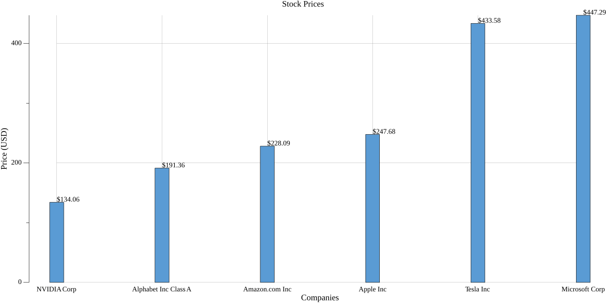

# 📈 stock-scraper 🚀

[](https://golang.org)
[](https://github.com/gocolly/colly)
[](https://gonum.org)
[](LICENSE)

> ⚡ A savage Go-powered scraper that literally goes to Google Finance, grabs real-time stock data like a Wall Street ninja, and plots a damn beautiful bar graph.  
> 💾 Saves CSV too because spreadsheets = ✨corporate comfort✨.

---

## 🧠 What It Does

This Go project scrapes **live stock market data** from [Google Finance](https://www.google.com/finance) using the beast 🕷️ `Colly` and visualizes it using `gonum/plot`.

It:
- 🕸️ Visits stock pages on Google Finance
- 🧠 Extracts **company name**, **stock price**, and **price change**
- 📦 Dumps all data to `stocks.csv`
- 📊 Generates a bar graph `stocks_graph.png` with prices

---

## 🔍 Tech Stack (aka What Makes This Sexy)

| Purpose         | Package                         |
|----------------|----------------------------------|
| Scraping       | [`github.com/gocolly/colly`](https://github.com/gocolly/colly) |
| Graph plotting | [`gonum.org/v1/plot`](https://gonum.org/v1/plot) |
| CSV Writing    | Built-in `encoding/csv` |
| Concurrency    | `sync.Mutex` for safe Go-routines |
| Sanity & Logs  | `log`, `fmt`, and `os` |

---

## 📸 Screenshot

> When you actually understand the stock market through pixels.



---

## 🏗️ How to Run This Thing?

```bash
# Clone the beast
git clone https://github.com/anandbhalerao18/stock-scraper.git
cd stock-scraper

# Run the Go scraper
go run main.go
